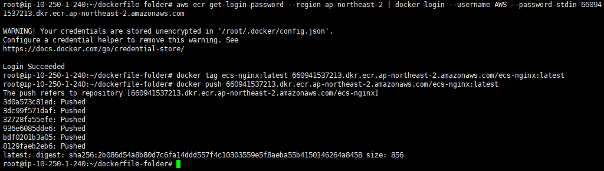
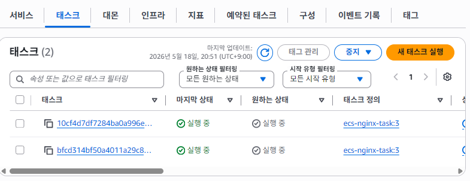
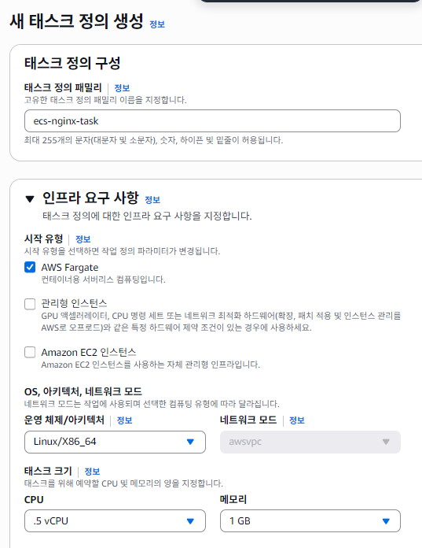
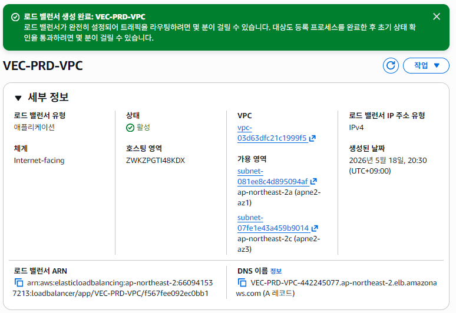

# AWS ECS 기반 컨테이너 서비스 구축

개인 실습으로 Fargate 기반 컨테이너 배포 환경을 먼저 구축했고, 이후 2인 팀 프로젝트에서는 Dockerfile 작성부터 ECR 이미지 관리, ECS 태스크 정의, 컨테이너 전용 보안그룹 구성, ALB 타겟 그룹 연동까지 구현 전 과정을 직접 담당했습니다. 팀원은 결과 검증과 발표 자료 정리를 맡았습니다.

---

## Architecture

---

## Tech Stack

`Docker` `Amazon ECR` `Amazon ECS(Fargate)` `ALB` `Route 53`

---

## 구현 내용

- 애플리케이션 컨테이너화를 위한 [Dockerfile](./Dockerfile) 작성 및 빌드
- Amazon ECR 리포지토리 생성 후 이미지 푸시 및 버전 관리
- AWS Fargate 시작 유형의 [ECS 태스크 정의](./task-definition.json) 작성
- 컨테이너 전용 보안그룹 생성, 포트 80 트래픽만 허용하도록 인바운드 규칙 제한
- ALB 타겟 그룹 연동으로 컨테이너 레벨 로드 밸런싱 구축
- ALB 타겟 그룹이 Healthy 상태로 정상 등록된 것까지 확인

---

## 검증 결과

### ECR 이미지 push 완료

### ECS 서비스 Running 상태

### 태스크 정의 설정

### ALB 타겟 그룹 Healthy 상태

---

## 발표 자료

[프로젝트 발표 자료 보기](https://github.com/gyu2001/aws-ecs-container-service/blob/main/aws-ecs-container-service.pdf)
